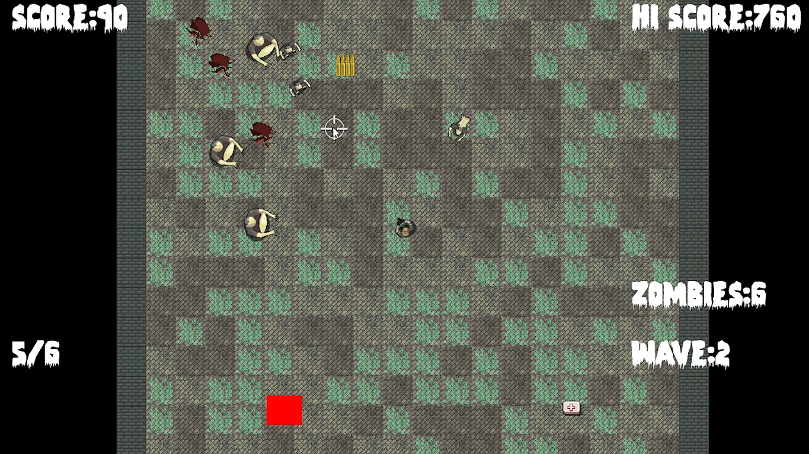

# ZombieLand



ZombieLand is a C++ SFML overhead shooter game with the player being chased by waves of zombies picking up ammo and health powerups along the way. With each additional wave, the game world increases in size and the player gets to pick from several options for increasing their abilities.

## Shipping, Distribution and Compilation

- This repository is private/internal; players recieve only the `dist/ZombieLand.zip`
- ZombieLand.zip includes the necessary Zombie.exe executable, required assets and dynamically-linked libraries necessary for the game to run.
- Compiling Zombie.exe will require the user to have SFML (https://www.sfml-dev.org/) and MSYS2 (https://www.msys2.org/) installed on their computer 

-The Zombie.exe executable is compiled with following command (purposely no Makefile for visibility, additional debugging, finding dlls, etc.):

```powershell
g++ ZombieArena.cpp Player.cpp CreateBackground.cpp Zombie.cpp CreateHorde.cpp TextureHolder.cpp Bullet.cpp Pickup.cpp -o Zombie.exe -I"C:/[PATH-TO-FOLDER]/msys2/current/ucrt64/include" -L"C:/[PATH-TO-FOLDER]/msys2/current/ucrt64/lib" -lsfml-graphics -lsfml-window -lsfml-audio -lsfml-system -lkernel32 "-Wl,--no-gc-sections"
```

These paths need to be altered to reflect the folders that include the developer's MSYS2 folders:
```powershell
"C:/[PATH-TO-FOLDER]/msys2/current/ucrt64/include"

"C:/[PATH-TO-FOLDER]/msys2/current/ucrt64/lib"
```

## Controls

| Key | Action |
|-----|--------|
| A/D | Move left / right |
| W/S | up / down |
| R   | Reload |
| Left Mouse | Rotate Player |
| Left Mouse Click | Fire |
| Enter | Start game / Pause game |
| Esc | Quit |

## CTF challenges

ZombieLand contains 3 flags:

    1) Infinite Ammo Flag- This flag requires the player to dynamically patch instructions at runtime with NOP using a debugger or Cheat Engine. 

    ghvctf{}

    2) Dead Code Flag- This flag will require the player to find the hidden function through static analysis using Ghidra, etc. and point the RIP pointer to the function.

    ghvctf{}

    3) Teleportation Flag- This flag requires the player to find a hidden area outside of the game map to teleport to. This will likely require the player to use both static (Ghidra, Ida, etc.) and dynamic analysis tools (Cheat Engine, x64dbg etc.)

    ghvctf{MRSPOCK66}

- Each of the flags will popup when found displaying the flag name and code
- Each of the flags codes are obfuscated using several different methods including (non-null terminated character arrays, XOR encryption, etc.) and are only reconstituted at runtime when triggered players finding flags

## Architecture

```text
Zombie/
├── ZombieArena.cpp / ZombieArena.h         game loop entry point, sprites           
├── Zombie.cpp / Zombie.h                   Zombie object logic, physics, updates
├── TextureHolder.cpp / TextureHolder.h     textures map
├── Player.cpp / Player.h                   Player object logic, physics, updates
├── Pickup.cpp / Pickup.h                   Health and Ammo Pickup object logic, updates
├── CreateHorde.cpp                         Zombie horde logic
├── CreateBackground.cpp                    Background
├── Bullet.cpp / Bullet.h                   Bullet object logic, physics, updates
```

## License

TBD
